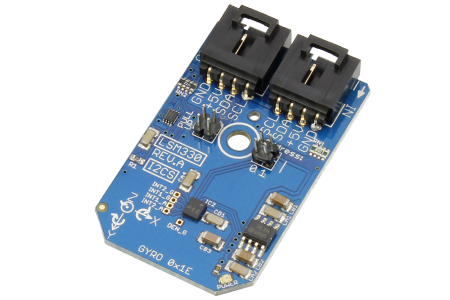

[](https://www.controleverything.com/content/Accelorometer?sku=LSM330_I2CS)
# LSM330
LSM330 3D Accelerometer 3D Gyroscope

The LSM330 device, provides digital acceleration and angular acceleration for X, Y and Z axis

This Device is available from ControlEverything.com [SKU: LSM330_I2CS]

https://www.controleverything.com/content/Accelorometer?sku=LSM330_I2CS

This Sample code can be used with Raspberry pi and Arduino.

## Java
Download and install pi4j library on Raspberry pi. Steps to install pi4j are provided at:

http://pi4j.com/install.html

Download (or git pull) the code in pi.

Compile the java program.
```cpp
$> pi4j LSM330.java
```

Run the java program.
```cpp
$> pi4j LSM330
```

## Python
Download and install smbus library on Raspberry pi. Steps to install smbus are provided at:

https://pypi.python.org/pypi/smbus-cffi/0.5.1

Download (or git pull) the code in pi. Run the program.

```cpp
$> python LSM330.py
```

## Arduino
Download and install Arduino Software (IDE) on your machine. Steps to install Arduino are provided at:

https://www.arduino.cc/en/Main/Software

Download (or git pull) the code and double click the file to run the program.

Compile and upload the code on Arduino IDE and see the output on Serial Monitor.

#####The code output is the raw values of acceleration and angular acceleration in X, Y and Z axis.
